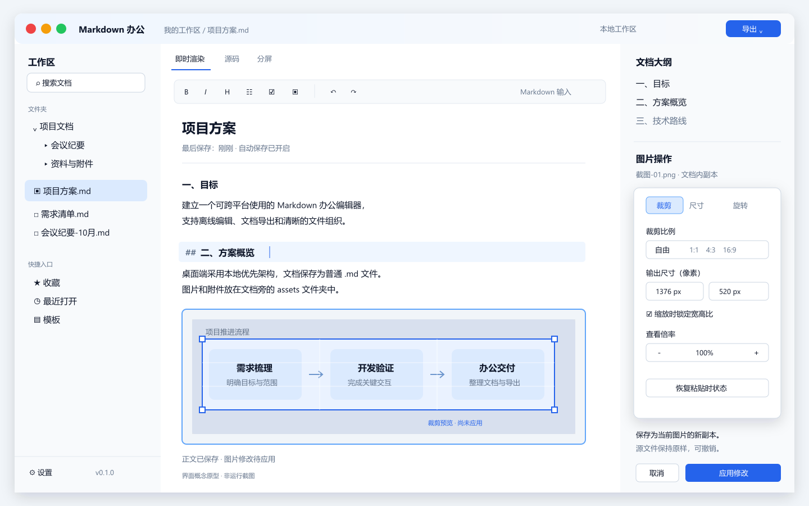

# Easy Markdown 完整设计方案

## 阅读导航

- [1. 产品定位与边界](#1-产品定位与边界)
- [2. 所见即所得的意义以及本次调整](#2-所见即所得的意义以及本次调整)
- [3. Markdown 格式与文档模型](#3-markdown-格式与文档模型)
- [4. 图片只修改当前插入实例](#4-图片只修改当前插入实例)
- [5. 办公功能](#5-办公功能)
- [6. 技术选择](#6-技术选择)
- [7. 为 Web 与移动端预留接口](#7-为-web-与移动端预留接口)
- [8. 工作区与数据迁移](#8-工作区与数据迁移)
- [9. 开源与版权管理](#9-开源与版权管理)
- [10. 桌面界面设计](#10-桌面界面设计)
- [11. 交付顺序与验收](#11-交付顺序与验收)
- [12. 后续阶段总原则与架构演进](#12-后续阶段总原则与架构演进)
- [13. 桌面增强阶段](#13-桌面增强阶段)
- [14. Web 阶段](#14-web-阶段)
- [15. 移动端阶段](#15-移动端阶段)
- [16. 同步阶段](#16-同步阶段)
- [17. 协作阶段](#17-协作阶段)
- [18. 插件与可选 AI 阶段](#18-插件与可选-ai-阶段)
- [19. 发布运维与开源治理](#19-发布运维与开源治理)
- [20. 契约数据格式与迁移设计](#20-契约数据格式与迁移设计)
- [21. 质量安全与阶段验收矩阵](#21-质量安全与阶段验收矩阵)
- [22. 版本路线图与启动条件](#22-版本路线图与启动条件)
- [23. 设计决策与待确认事项](#23-设计决策与待确认事项)

本方案根据四项要求修订：当前只开发桌面端；解释并调整编辑模式；支持双击粘贴图片进行副本编辑；建立开源与素材授权管理。本文是产品与技术设计建议，界面图是静态概念原型，尚未实现桌面应用。

## 1. 产品定位与边界

产品定位：本地优先、支持 Markdown 即时渲染、面向日常办公的跨平台桌面编辑器。

首发平台为 Windows、macOS、Linux。在三个系统上交付一致的文档格式与核心编辑能力，按系统习惯适配菜单、文件对话框和快捷键。Web 与移动端以后开发；当前通过核心代码解耦、版本化的数据格式及能力接口预留扩展。

典型场景：会议纪要、周报、需求说明、项目方案、个人笔记、带截图的操作手册。应用默认离线工作，不需要账号，文档以普通 .md 文件保存。

第一版不引入实时协作、自建云平台、插件市场和独立的富文本编辑器。预留接口不等于提前建设完整的后端或移动应用。

## 2. 所见即所得的意义，以及本次调整

所见即所得描述的是交互方式，Markdown 描述的是文件格式。用户点击“标题”“表格”可以不手写符号，软件依然能够保存 Markdown。它的价值是降低非技术用户的学习成本，并让表格、图片等内容更容易操作。

但隐藏语法会带来成本：复杂语法往返转换、原有空格与注释保留、未知扩展处理都更困难。原方案把源码、所见即所得和分屏同时作为核心，范围偏大。

本方案采用一个 CodeMirror 6 编辑内核，提供三种视图：

| 视图       | 用户体验                                    | 第一版 |
| -------- | --------------------------------------- | --- |
| 即时渲染（默认） | 输入 Markdown，离开当前段落后显示排版结果；光标进入段落时露出必要语法 | 支持  |
| 源码       | 所有 Markdown 保持可见，适合批量修改和精确控制            | 支持  |
| 分屏       | 左侧源码、右侧预览，点击图片可操作文档内副本                  | 支持  |

默认视图示例：输入 `## 本周进展` 后显示二级标题；重新进入标题段落时能看到并编辑 `##`。输入图片引用后显示图片，双击打开图片操作面板。工具栏“加粗”和“插入表格”等命令直接修改 Markdown 文本。

纯可视化编辑作为以后可选功能，届时评估 ProseMirror。它不必成为第一版依赖，也不与源码编辑器维护两份独立正文。

## 3. Markdown 格式与文档模型

基线采用 CommonMark，办公扩展采用 GFM 表格、任务列表和删除线。随后加入脚注、数学公式、Mermaid 和 Front Matter，按模块开启。MDX 含可执行组件，与普通 Markdown 办公文件用途不同，第一版不作为受支持格式；可用源码视图查看。

Markdown 原始文本是唯一正文来源。语法树、HTML 预览、大纲和搜索索引都是从文本生成的派生数据。编辑命令使用源位置定位，只修改目标范围；打开保存不做整篇格式重写，切换视图不重写文件。未知语法显示原始片段，保留注释、Front Matter、引用式链接及用户原有换行。

解析管线：原始文本 → 带源位置的 AST → 即时渲染节点 / 大纲 / HTML / 导出适配器。编辑视图可使用 CodeMirror 自带的增量语法能力；共享文档解析结果提供预览和导出，避免每次按键重建整篇文档。

正文状态建议包含 id、uri、text、revision、dirty、baseRevision。工作区接口用资源 URI 和相对路径识别文档，核心代码不拼接 Windows 盘符，也不假设移动端具有普通磁盘路径。

## 4. 图片：只修改当前插入实例

### 4.1 明确四类图像数据

- 用户磁盘上的源文件：只读导入，绝不覆盖。
- 剪贴板中获得的像素或图像字节：导入后独立保存。若剪贴板只有截图像素，应用不猜测其来源文件。
- 应用保存的粘贴时源副本：用于恢复，保持不变。
- Markdown 当前引用的显示副本：可通过裁剪、缩放等操作生成新版本。

每次插入有独立实例 ID。同一图片插入两次，编辑其中一次只替换该实例的引用；即便内部按哈希共享源字节，也不修改被其他实例引用的资源。

### 4.2 粘贴与导入

支持截图粘贴、图片文件粘贴、拖入文件及“插入图片”。第一版保证 PNG、JPEG；其他格式在验证解码器和许可后逐步加入。透明截图优先保留 PNG；JPEG 读取 EXIF 方向后正确展示；记录资源类型，避免单凭后缀识别。

先将图像导入工作区，再插入相对资源链接。文档尚未保存时，图像进入应用草稿目录；首次保存时迁移到目标工作区并更新路径。网络图片默认保留原链接，进行像素编辑前导入本地副本。

### 4.3 双击交互

单击图片显示选中框，双击打开右侧图片面板。分屏与预览中的双击同样定位对应 Markdown 图片节点；全源码视图通过预览和右键菜单操作。图片面板提供：

- 裁剪：自由比例、1:1、4:3、16:9，拖动裁剪框、数值输入和重置。
- 输出尺寸：宽高像素输入、锁定宽高比、等比放大缩小。
- 旋转与翻转：90° 旋转、水平/垂直翻转。
- 图片说明：编辑 Alt 文本。
- 恢复粘贴时状态、取消、应用修改。

查看倍率只改变图片操作视图；输出尺寸会改变显示副本的像素尺寸。压缩和格式转换放在后续办公增强版本。

### 4.4 Markdown 图片尺寸兼容性

标准 `` 没有通用的显示宽高语法。因此，“像素缩放”与“文档中的显示宽度”必须区分。

默认标准模式将像素操作写入新的普通图片，正文保持标准 Markdown。图片在文档中按自然尺寸显示并限制最大宽度，跨软件能看到裁剪后的内容。

如用户需要严格指定显示宽度，可启用 HTML 兼容模式，保存如 ``。本应用支持渲染与导出；外部软件是否支持取决于其 HTML 策略。尺寸不能只藏在本应用数据库里，否则离开软件就丢失排版意义。

### 4.5 非破坏保存与恢复

示例流程：

```text
磁盘源文件 / 剪贴板图像
        ↓ 只读导入
assets/.originals/img-k8.png   （源副本保持不变）
        ↓ 内存中预览裁剪、缩放
点击“应用”
        ↓
assets/img-k8-v2.png          （生成新的显示副本）
        ↓
将当前节点更新为 
```

每次应用都从源副本与累计操作参数生成结果，减少重复压缩损失。记录参数坐标系和操作顺序：方向归一化 → 裁剪 → 旋转/翻转 → 重采样 → 编码。撤销通过恢复旧引用和参数完成；恢复原始状态生成或引用未经变换的副本。

先完成资源文件写入，再提交正文引用变更；通过恢复日志处理跨文件提交。写入失败不得改变正文。取消操作丢弃预览，不创建文档可见的新版本。图片应用与正文引用更新作为一个逻辑事务，草稿快照也包含资源引用。

历史参数保存在 .easym/images.json，使用版本化 JSON Schema：schemaVersion、instanceId、sourceUri、displayUri、operations、revisions、sourceHash。Markdown 始终引用已经生成的显示副本，其他编辑器不依赖此元数据也能看到编辑结果。元数据丢失时仍能查看正文，但恢复原图和重编辑历史会受限。

图片引用清理需考虑所有正文、历史和草稿。第一版提供空间查看与手动清理，不在关闭文档时自动删除副本。

## 5. 办公功能

### 编辑与组织

工作区文件树、多文档标签页、目录大纲、最近打开、收藏；查找替换与全文搜索；标题、表格、任务列表、引用、代码块、图片和链接。表格支持菜单插入/删除行列；从表格数据粘贴时转为 GFM 表格。支持会议纪要、周报、需求说明与操作手册模板。

中文输入体验作为第一版验收重点：输入法组合期间不触发 Markdown 自动转换；提供 Windows/Linux 的 Ctrl 与 macOS 的 Cmd 快捷键；支持高 DPI、键盘导航、屏幕阅读器语义和可调字体。搜索采用 SQLite FTS5，并为中文引入字符切分索引或其他经过许可核查的分词方案，不能直接假设默认分词器能覆盖中文全文搜索。

### 保存与版本

自动保存采用短延迟合并，在失焦和正常退出时补充保存。写入使用同目录临时文件和平台对应的原子替换策略；草稿恢复独立于原文件。首次保存可选择 UTF-8 和换行格式，已有文档尽量保留原格式。

监听外部文件修改，通过内容哈希/版本判断：没有本地改动则重新加载；有未保存改动则显示差异并允许保留本地、加载外部或保存冲突副本，不能仅按最后修改时间静默覆盖。重命名/移动文档时更新相关相对图片路径，并处理路径冲突。完整三方合并留待办公增强版本。

### 导出

第一版提供 Markdown、HTML 和系统打印/PDF；办公增强版增加 DOCX。HTML 导出可选择携带资源文件夹或嵌入图片，打印使用独立样式，支持 A4、页边距、长表格与跨页代码块。

Tauri 的各平台 WebView 不同，不能承诺同一打印 HTML 在三个系统上像素一致。先提供经过各平台验证的打印闭环；需要统一分页、页眉页脚时再增加专用 PDF 导出器。第一版仅在系统提供相应能力时支持“打印为 PDF”，不伪称统一 PDF 引擎。

DOCX 使用带许可声明的 docx 库，将 AST 映射为标题、段落、表格、列表与图片。不要求安装 Microsoft Word，不默认捆绑 Pandoc。公式与流程图可转为图像导出，复杂布局存在格式差异，应通过样例集验证，而非承诺与屏幕预览完全相同。

### 文档打开与资源权限

Markdown 预览默认清理可执行 HTML，图片与链接访问通过资源适配器控制。工作区外图片作为用户明确插入的只读资源导入，不让文档中的任意路径获得系统写权限。资源路径限制在被授权的工作区内，图片解码设置像素与内存上限，远程链接由系统浏览器打开。这些限制属于实现层，正常编辑界面无需展示技术术语。

## 6. 技术选择

| 部分       | 建议                        | 理由                       |
| -------- | ------------------------- | ------------------------ |
| 桌面壳      | Tauri 2                   | 本地文件、窗口、菜单、剪贴板集成         |
| 界面       | React + TypeScript        | 可复用组件及平台接口类型             |
| 编辑内核     | CodeMirror 6              | 源码编辑与即时渲染基于一个文本状态        |
| Markdown | unified / remark / rehype | AST、扩展语法、HTML 渲染与导出      |
| 本地服务     | Rust                      | 文件保存、资源处理、系统接口           |
| 图片处理     | Rust image crate          | 后台裁剪、旋转、重采样与编码           |
| 搜索索引     | SQLite FTS5               | 可重建索引，正文不入库作为唯一副本        |
| DOCX     | docx（后续）                  | 结构化生成 Office Open XML 文档 |
| 图标       | 项目自绘 SVG 或已审查的 Lucide     | 统一外观与可追溯授权               |

Tauri 通常减少应用捆绑浏览器的体积，但安装体积、内存和系统兼容性需实测，不能仅凭技术名称保证。Windows WebView2、macOS WKWebView、Linux WebKitGTK 的差异是桌面回归测试重点。图片解码和大资源操作放入后台任务，避免阻塞输入。

## 7. 为 Web 与移动端预留接口

划分为界面组件、应用服务、纯 TypeScript 文档核心、平台适配器。文档核心只处理文本、语法、源范围和命令，不调用 Tauri API、系统剪贴板或 Node 文件系统。Rust 原生服务由桌面适配器封装，未来浏览器可以使用 Worker / Canvas / WASM 实现相同接口；共享功能契约与结果要求，不要求所有原生代码原样运行在浏览器。

建议能力接口：

```ts
type ResourceUri = string
type Capability = "folderAccess" | "fileWatch" | "clipboardImage" | "nativePrint"

interface StorageProvider {
  readText(uri: ResourceUri): Promise<DocumentSnapshot>
  writeText(uri: ResourceUri, text: string, expectedRevision: string): Promise<SaveResult>
  readAsset(uri: ResourceUri): Promise<Uint8Array>
  writeAsset(bytes: Uint8Array, mime: string): Promise<ResourceUri>
}

interface ImageProcessor {
  transform(input: Uint8Array, recipe: ImageRecipe): Promise<ImageResult>
}

interface PlatformAdapter {
  capabilities: ReadonlySet<Capability>
  readClipboardImages(): Promise<ClipboardImage[]>
  pickDocuments(): Promise<ResourceUri[]>
  watch?(uri: ResourceUri, onChange: (event: FileChange) => void): () => void
}

interface ExportProvider {
  export(request: ExportRequest): Promise<ExportArtifact>
}
```

接口中的图片变换参数、文件/资源描述、文档版本和错误码使用版本化 JSON 契约；图像本身使用字节数组。命令包括 insertImage、applyImageEdit、updateImageReference、moveDocument、exportDocument，UI 不直接写磁盘。示例类型是契约草案，具体字段在开发时定义。

浏览器和移动端可能没有持续文件监听或任意文件夹访问。通过能力探测决定是否显示对应操作，仍保证文档与资源可读写；未来移动 UI 会重新适配布局，核心命令与文件格式可以复用。

同步仅预留 SyncProvider 和基础版本字段，当前不实现云账户或同步服务。以后增加三方合并、冲突副本，再考虑实时协作，不能把文本文件接口直接等同于 CRDT 协作模型。

## 8. 工作区与数据迁移

```text
工作区/
├── 项目方案.md
├── 会议纪要.md
├── assets/
│   ├── img-k8-v1.png
│   ├── img-k8-v2.png
│   └── .originals/
│       └── img-k8.png
└── .easym/
    ├── images.json
    └── workspace.json
```

.easym 是本方案约定的工作区元数据目录名；若早期实现采用其他目录名，按第 20 章执行显式迁移。搜索数据库、窗口位置、最近打开和缓存放在系统应用数据目录，工作区中的 JSON 只保留需要迁移的图片历史与设置。隐藏目录可用普通文件工具读取，不进行格式加密或封装。

导出可分为“交付包”（正文与显示图片）和“完整工作区”（含源副本和编辑历史）。复制整个工作区到另一系统后用相对路径恢复；复制单个 .md 不含图片，应通过打包导出避免断链。外部修改图片引用后重新绑定实例，无法恢复绑定时保留实际文件链接，不猜测并覆盖资源。

## 9. 开源与版权管理

建议自有代码使用 Apache-2.0：允许复用、修改和商业分发，并包含明确的专利授权条款。它也允许他人制作闭源衍生产品；如果未来要求衍生作品持续开源，应重新选择相应的 copyleft 方案，不应在 Apache-2.0 上追加矛盾限制。[Apache-2.0 官方条文](https://www.apache.org/licenses/LICENSE-2.0)

开源软件依然有版权。“公开源码”与“依授权使用”是两回事，不能承诺使用开源依赖就绝无版权问题；可执行的要求是每项代码、素材和运行时都有来源、许可和正确的分发声明。

当前候选组件的上游声明如下，实际发布以锁定版本与完整依赖树为准：

| 组件                        | 上游许可                                |
| ------------------------- | ----------------------------------- |
| Tauri                     | MIT / Apache-2.0；具体子包逐项确认           |
| React                     | MIT                                 |
| TypeScript                | Apache-2.0                          |
| CodeMirror 6              | MIT                                 |
| unified / remark / rehype | MIT，插件逐项确认                          |
| Rust image                | MIT 或 Apache-2.0，解码器等传递依赖逐项确认       |
| SQLite                    | 上游 public domain 声明，Rust 绑定按其自身许可检查 |
| docx                      | MIT                                 |
| Lucide                    | 主体 ISC，部分继承图标仍附 MIT 声明              |

来源：[Tauri](https://github.com/tauri-apps/tauri)、[React](https://github.com/react/react/blob/main/LICENSE)、[TypeScript](https://github.com/microsoft/TypeScript/blob/main/LICENSE.txt)、[CodeMirror](https://github.com/codemirror/dev/blob/main/LICENSE)、[remark](https://github.com/remarkjs/remark/blob/main/license)、[image](https://github.com/image-rs/image)、[SQLite](https://sqlite.org/copyright.html)、[docx](https://github.com/dolanmiu/docx/blob/master/LICENSE)、[Lucide](https://github.com/lucide-icons/lucide/blob/main/LICENSE)。

执行规则：

1. 发布仓库及安装包保留 LICENSE、NOTICE（有适用上游声明时）、第三方版权原文及来源清单。
2. npm 和 Cargo 依赖锁版本；对直接与传递依赖生成 SPDX / CycloneDX SBOM。未知许可证需人工确认，多许可表达式区分 AND/OR，不简单通过字符串白名单放行。
3. 优先选择 MIT、Apache-2.0、BSD、ISC 等宽松组件。GPL/AGPL 是合法开源许可证，问题是具体集成与分发义务；本产品不默认捆绑这类组件，需要引入时单独评估兼容性。
4. 系统字体按系统方式调用，不提取并打包微软雅黑、苹方等商业字体；如捆绑字体，选明确允许分发的字体并保留其许可。
5. 图标、示例图片、模板、界面文案独立创作或使用已确认授权的素材；代码许可不能自动覆盖项目 Logo、商标和网站图片。
6. 贡献者通过 DCO 签署确认贡献权利，并在贡献文档明确“贡献按项目许可提交”。保留提交与授权记录。
7. Windows WebView2 等系统运行时按各自的分发条款处理；应用开源不意味着依赖的操作系统运行时也是开源。

界面概念图由 SVG 基本图形和文字独立绘制，未使用第三方产品截图、商业图片、Logo 或外部图标素材。操作系统只用于渲染字体，未将字体文件作为交付内容。产品正式命名前另查重名与商标。

## 10. 桌面界面设计

见 [PNG 界面图](desktop-ui-mockup.png) 与 [可编辑 SVG](desktop-ui-mockup.svg)。



左侧为文件夹、搜索、收藏、最近打开和模板；中央为文档标签、视图切换、工具栏与正文；右侧显示大纲并在图片双击后展开操作面板。正文中显示裁剪框，右侧配置比例、尺寸、查看倍率、恢复、取消和应用。

图中展示“正文已保存、图片修改待应用”的状态：用户仍在裁剪预览，尚未改写正文引用。活动标题行露出 ##，说明默认即时渲染仍支持 Markdown 输入。没有云分享或协作入口，顶部仅提供办公导出。

界面支持可收起侧栏、专注模式、深浅色主题和系统快捷键；面板的数值输入为无法使用鼠标拖拽的用户提供替代操作。

## 11. 交付顺序与验收

本章为桌面闭环的概要；后续版本的完整范围、依赖和验收门槛见第 12—23 章。所有日期均需技术验证后另行排期。

| 阶段     | 目标         | 交付                                      |
| ------ | ---------- | --------------------------------------- |
| 编辑内核验证 | 确认输入与文件可靠性 | 即时渲染、源码、分屏、中文输入、打开保存、原文保留               |
| 图片闭环   | 验证副本编辑与回滚  | 粘贴、拖入、双击、裁剪、尺寸、旋转、应用、取消、恢复              |
| 桌面可用版  | 日常办公可使用    | 文件树、大纲、标签页、模板、搜索、自动保存、恢复、外部冲突处理、HTML/打印 |
| 办公增强版  | 提高交付质量     | DOCX、专用 PDF、图片压缩、完整版本历史、外部文件差异合并        |
| 后续多端   | 复用文档与接口    | Web/移动适配器、界面适配、同步与冲突处理                  |

不预先承诺日历工期：首先完成编辑内核与三系统图片/打印技术验证，确认工作量后排期。

验收重点：

- 打开后不编辑再保存：内容、注释、未知语法与换行保持；视图切换不重写正文。
- 中文输入法组合、长文、表格输入、大图片操作时输入不中断。
- 图片应用后源文件哈希不变；同图的另一处引用不变；取消不改变文件引用；撤销回到旧版本。
- 保存/生成图片中途模拟失败：正文不引用不存在的资源，重启可恢复可用版本。
- 未命名文档粘贴图片后首次保存、跨文件夹移动、跨系统复制工作区，图片路径可恢复。
- 删除搜索缓存后能从文件重建；外部编辑同一文件时不能静默覆盖未保存修改。
- 普通第三方 Markdown 软件能查看最终图片；完整工作区可在本应用恢复源副本与参数。
- 三系统导出样例验证表格、图片、长段落和分页；记录原生打印能力的差异。
- 发布包中的锁定依赖、SBOM、许可全文与素材来源相符。

本文中的接口与数据结构是设计契约草案，功能完成情况以实际实现和验收为准。

## 12. 后续阶段总原则与架构演进

### 12.1 阶段边界

后续阶段是设计储备，不要求首版同时建设账号、服务器、移动壳和插件市场。首期只需建立可验证的接口、格式、错误分类和契约测试；无实际需求的抽象不提前实现。

| 层                    | 职责                       | 复用规则                        |
| -------------------- | ------------------------ | --------------------------- |
| Document Core        | 文本命令、源范围、Markdown AST、撤销 | 纯 TypeScript，不导入 Tauri/Node |
| Resource Services    | 图片实例、资源定位、哈希和提交日志        | 通用契约，平台独立实现                 |
| Application Services | 版本、索引、导出、后续同步与协作         | 使用平台能力，不直接写磁盘               |
| Platform Adapter     | 文件、剪贴板、窗口、权限、后台任务        | 桌面/Web/移动分别实现               |
| UI Shell             | 文件树、编辑、图片面板、触控交互         | 共享基础组件，布局按平台重做              |

概念关系：

```text
桌面 UI      Web UI      移动 UI
   └──────────┬──────────┘
        统一命令与应用服务
       Markdown 文档核心
   ┌──────────┼──────────┐
Tauri/Rust  浏览器 API  移动系统 API
```

### 12.2 不变约束

- Markdown 原文是唯一正文。AST、协作结构、数据库和缓存不是另一个独立正文副本。
- 图片资源一旦被正文/历史引用即视为不可变；编辑新建显示副本，不原地覆盖。
- 任何跨文档、图片和元数据的更新都按逻辑事务执行，无法完全原子时使用恢复日志。
- 未知语法保留；未知元数据可读不乱写；外部工具不支持扩展时仍能看到普通文本和最终图片。
- 文件/云服务/插件权限由用户显式授权。默认不上传正文、图片或诊断信息。
- 预留能力不等于承诺所有平台功能一致；不能实现时显示限制和替代路径。

### 12.3 扩展语法路线

先稳定 CommonMark + GFM，再逐项引入脚注、KaTeX 类公式渲染、Mermaid。每个扩展都要明确语法版本、许可、源码保留、HTML/PDF/DOCX 降级行为。公式/图表转换为图片时同时保留源文本；图表节点不执行任意脚本。MDX、任意脚本模板和可执行代码块不进入默认办公模式。

未来评估纯可视化编辑时，需要先完成“导入—编辑—导出不丢未知语法”的样例测试。ProseMirror 只是候选，不承诺无损转换所有 Markdown；不能安全转换的节点显示为可编辑原文块，不能悄悄清除注释或格式。

## 13. 桌面增强阶段

目标：从可编辑工具提升为能稳定交付办公文档的桌面软件。

### 13.1 DOCX 导出

从共享 AST 映射标题、段落、编号、表格、超链接、代码和图片；不通过复制预览 HTML 猜测结构。模板定义页面尺寸、页边距、标题样式和表格样式，支持中文字体回退。

任务列表用勾选符号或静态复选框表达；公式、Mermaid 和复杂图片布局按能力转换为图像；不支持的嵌入 HTML 产生导出警告。样例需在 Microsoft Word、LibreOffice 及选定版本的 WPS 中检查，不承诺像素一致。

导出前列出缺失资源、超宽表格、未知节点和字体替换。缺失关键资源默认阻止导出，用户可明确选择带占位符的版本。DOCX 是交付格式，导入 DOCX 的可逆性与保真难度另行立项，不作为导出功能的附带承诺。

### 13.2 专用 PDF 引擎

先保留系统打印；需稳定分页时独立评估 HTML 分页/浏览器引擎与结构化排版引擎。比较中文换行、嵌入字体授权、超长表格、脚注、页码、公式、包体积和三平台运行成本，选择一种作为受支持引擎。

提供 A4/Letter、页边距、页眉页脚、自动目录、图片约束、表格跨页重复表头、代码换行选项。PDF 预检提示孤行、空白页和超页宽内容。引擎的分发许可与字体嵌入许可均是发布门槛，不为统一分页默认捆绑未经审查的浏览器或商业字体。

### 13.3 完整版本历史

快照包含正文、资源清单、图片参数、共同祖先和触发原因。编辑撤销栈与持久版本历史分开：撤销解决当前会话操作，历史解决跨会话恢复。

快照在首次保存、重要操作、同步前和合并完成时创建；自动快照节流并按可配置保留期清理。正文使用完整快照或增量加定期检查点，图片用内容寻址共享不可变字节。历史清理不得删除仍被其他文档、草稿或分享快照引用的资源。

恢复默认生成新版本，可选另存副本；先显示差异，不直接抹去现有历史。时间线支持命名、搜索、图片对照和导出。历史不是独立备份，界面明确设备损坏仍可能丢失，应提供工作区备份包。

### 13.4 差异和三方合并

以共同祖先 B、本地 L、外部 R 进行三方合并。无交叠改动可自动合并，有交叠时进入并排/三栏差异界面，用户选择本地、外部或手工结果。

表格和图片引用可提供结构化对照，但最终提交仍是文本范围修改。合并前保存双方快照；结果需要经过资源完整性检查。无共同祖先时生成明确的冲突副本，不把双向覆盖称为合并。

图片操作冲突保留双方显示副本和操作参数。复制冲突文档时迁移相对路径，不把一个实例的变更扩散到其他图片引用。

### 13.5 批量图片处理

支持压缩、格式转换、去除 EXIF 等元数据、限制长边、选定图片或整个工作区批处理。区分隐私去元数据与画质优化；透明图转 JPEG 时要求选择背景色。

先显示预计体积与画质对照，再按每个实例创建新版本。默认仍不覆盖用户源文件和粘贴时源副本。批次日志记录成功、失败和取消项；只更新成功生成资源的引用。失败保留旧版本，提供重试与整批撤销。

### 13.6 模板与可访问性

模板由 Markdown、资源、变量声明、版本和许可证组成。变量包括标题、日期、作者、项目名；模板引擎只做值替换和有限条件，不运行脚本。工作区模板与用户模板分开，升级不得覆盖用户修改。

提供命令面板、可重绑定快捷键、焦点顺序、可见焦点、读屏标签、减少动画和高对比主题。裁剪框可用数值与键盘操作；移动焦点到图片时有文字说明。以 WCAG 2.2 AA 的相关条目作为参考，并结合桌面平台可访问性 API 验证，而非只用网页自动扫描判定通过。

### 13.7 大文档与性能

建立小文档、5 MB 文本、100 KB 超长单行、大表格、数百图片和高像素图片的样例集。使用增量解析、视口渲染、Worker/Rust 后台任务、取消令牌和有界缓存；图片需限制解码后的像素数，不只限制压缩文件大小。

在固定 CPU/内存/系统版本的基准机上制定输入延迟 p95、启动时间、保存时间和内存预算。暂定常规输入延迟 p95 不超过 50 ms 为待验证目标；超大文档可进入源码优先模式，说明渲染降级。不在未实测前承诺任意大小的文档都流畅。

本阶段验收：关键办公样例可导出；版本可恢复；合并不覆盖任一方；批图失败可回滚；三平台输入法、键盘和读屏路径可用。

## 14. Web 阶段

### 14.1 定位与架构

先做不需要账号的浏览器编辑/PWA，后接可选同步。复用 React 组件、文档核心和服务接口，重新实现浏览器 StorageProvider、ImageProcessor 和权限交互；不直接调用桌面 Rust 命令。

桌面可分享普通 Markdown + 资源 ZIP 给 Web，Web 可导出同格式包回桌面。ZIP 是传输容器而非新正文格式，导入需要路径穿越、解压体积、文件数量及重复路径检查。

### 14.2 文件与本地存储

| 情形              | 存储方式                   | 用户说明              |
| --------------- | ---------------------- | ----------------- |
| 浏览器支持文件系统访问且已授权 | File System Access API | 授权可能在下次会话失效       |
| 不支持或拒绝目录授权      | 文件选择导入、下载导出            | 编辑的是应用副本，不自动写回原文件 |
| 应用草稿/图片/待同步队列   | IndexedDB，按需使用 OPFS    | 站点数据可能被清理，不替代备份   |

OPFS 可作为性能优化，但不是用户可直接浏览的工作区目录。持久存储申请不是不丢失承诺；显示配额使用、最近导出时间和备份提醒。容量不足先保留现有快照并阻止危险操作，不在保存失败后清掉旧资源。

### 14.3 离线与应用更新

Service Worker 只缓存应用壳和授权的本地资源。先保证本地保存再进行联网同步；离线状态明显显示，待上传不等于已同步。草稿在输入后节流落盘，不依赖页面关闭事件保证持久化。

PWA 更新提示在用户确认并保存后切换版本；旧缓存待新版本验证后清理。数据库迁移失败回到旧版本或只读导出，避免半迁移状态。不缓存有权限的分享内容到其他用户可读的公共缓存。

### 14.4 图片处理与浏览器限制

使用 Canvas/OffscreenCanvas + Worker 或经许可审查的 WASM 解码器；支持范围通过能力探测确认。剪贴板读取需 HTTPS、用户动作及浏览器权限；不可用时提供上传/拖放。

跨源图像可能因 CORS 无法读取像素；不靠代理绕过授权。让用户导入本地副本，或在未来受控服务中按权限获取。大图先缩小预览、应用时生成最终副本；空间/内存不足明确失败，不提交无效图片引用。支持的图片操作顺序和元数据与桌面相同，编码字节允许平台不同。

浏览器无可靠后台常驻、任意文件监听和系统级打印控制；前台刷新重新核对文件，系统打印/PDF只按浏览器能力提供。专用 PDF 可以使用 WASM 或显式远程任务，但远程任务必须经用户授权上传。

### 14.5 验收

Chrome、Edge、Firefox、Safari 分别验证支持与不支持 File System Access 的路径；测试离线重开、容量不足、权限撤销、刷新中断、PWA 更新回滚和 ZIP 往返。所有文件操作都显示“草稿已保存/原文件已写入/待导出”的准确状态。

## 15. 移动端阶段

### 15.1 产品范围与选型

先做阅读、轻编辑、任务清单和截图/照片编辑；大批量文档管理、复杂导出和插件不必同步首发。Android/iOS 均支持无账号离线。

候选 Tauri Mobile 与 React Native 通过垂直切片比较：中文输入法、编辑内核、文档提供器、相机、图片处理、后台保存、包体积和可访问性。Tauri 可复用 Web 编辑内核但系统插件需适配；React Native 若嵌入 WebView 编辑器会增加桥接复杂度。选型冻结前不得宣称“桌面代码直接运行在手机”。

### 15.2 系统文件访问

Android 使用 Storage Access Framework，iOS 使用系统文档选择器及必要的 security-scoped 权限。文档提供器可能是云盘，不一定支持随机写入、原子替换或持续监听，必须按能力处理。

用户选择“导入副本”或在提供器支持时“编辑原文件”，清楚显示模式。无法原子写回时先保留应用快照并采用安全另存，而非假设移动 URI 等于磁盘路径。保存权限失效时继续编辑沙盒草稿，提示重新授权/导出。

### 15.3 触控交互与图片

手机单栏，底部固定标题、加粗、列表、链接、图片、撤销入口；文件树和大纲为抽屉。平板横屏可展开双栏，虚拟键盘弹出后工具栏保持可达。触控选区避开滑动手势冲突，支持外接键盘。

图片从相机、相册、系统分享和可用剪贴板导入。移动端以点按图片后“编辑”按钮为主，可兼容双击；全屏图片面板提供触控裁剪、比例、旋转、翻转、尺寸和恢复。数值入口替代双指手势。仍只操作应用导入副本，不写回相册源照片。

按系统方向展示照片，可选删除定位等 EXIF 元数据；默认源副本也可能含敏感信息，用户选择隐私导入时先移除不必要元数据再保存。图片预览与最终处理分离，低内存或后台中断恢复旧引用。

### 15.4 离线草稿与后台

编辑持续保存草稿快照，应用切后台时尽力刷盘，但不依赖后台无限运行。同步队列遵循系统后台任务限制；未完成上传保持待同步状态。

验收覆盖输入法组合、系统分享、相册权限拒绝/受限、旋转屏幕、低内存回收、后台终止、文件提供器失联和外接键盘。恢复后正文与图片仍组成一致版本。

## 16. 同步阶段

### 16.1 范围和实施顺序

同步解决多设备文件副本一致性，不等于同时在线协作。先做单用户，后做团队服务。

| 提供者                 | 设计                        | 限制                               |
| ------------------- | ------------------------- | -------------------------------- |
| LocalFolderProvider | 读取本地工作区；同步引擎使用其快照         | 自身不是网络同步服务                       |
| 云盘同步文件夹             | 本应用按外部修改处理，尊重云盘冲突文件       | 无法保证云盘远端已完成上传                    |
| WebDAV              | 基于 ETag/条件写入和临时资源提交       | 需实测服务端条件写入语义；续传为可选能力             |
| Git 文件夹             | 查看差异、提交、拉取、推送；可用系统 Git 适配 | 默认不 force push；二进制历史体积与 Git 许可另审 |
| 自有同步服务              | 元数据版本服务 + 对象存储 + 身份服务     | 需单独投入隐私、备份、费用和运维                 |

优先完成本地/云盘安全冲突处理，再选 WebDAV 或 Git 中的一项实现。Git 适配不直接绕过未提交工作区和其他工具；凭据使用系统凭据存储，索引缓存与设备状态不入库。

### 16.2 数据和一致性

文档有稳定 documentId；资源有 assetId/hash，实例有 instanceId。路径是当前定位，不是跨端身份。revision 是 Provider 发出的不透明并发令牌，contentHash 描述原始字节，parentRevision/baseSnapshot 用于追踪共同祖先；时间只用于显示，不用于决定胜者。

同步引擎先上传不可变资源，再提交引用这些资源的文档清单；接收端检查资源完整性后应用正文。删除使用 tombstone，经过保留期与已知设备确认才清理；长时间离线设备回归时需全量协调，不能自动复活旧删除或把其他端新版本删掉。

条件写入失败即冲突，不通过简单“重试覆盖”绕过。提供者不能保证条件更新时，采用保守的冲突副本/不可变提交清单策略并说明限制，不能虚构原子 CAS 保证。

### 16.3 冲突与离线恢复

保留共同祖先并三方合并，无法自动合并时同时保存双方和资源。重命名/移动与修改冲突按 documentId 对照，删除与编辑冲突默认恢复编辑副本并要求决定。

持久队列记录 operationId、目标、依赖和重试状态。重试指数退避、有界并可暂停；鉴权错误停止反复重试，提示重新登录。重复提交具备幂等性，断网期间编辑不被锁死。显示本地已保存、待上传、已同步、冲突四类状态；云盘目录只显示本地状态。

### 16.4 安全、加密与验收

TLS 和系统钥匙串为基线。端到端加密是独立可选方案：需要设备密钥、恢复密钥、轮换、吊销和丢失恢复；默认服务端明文存储时不得宣传 E2EE。启用后还需解释服务端全文搜索与链接分享的限制。删除请求覆盖对象、历史、备份保留和审计策略。

测试两设备离线编辑、同图同时编辑、时钟漂移、部分上传、过期 ETag、重复请求、删除/移动、权限失效和服务器回滚；任一场景不可静默覆盖未同步内容。

## 17. 协作阶段

### 17.1 分享与评论先行

第一步是版本化只读分享，不必立即实时编辑。区分“固定快照”与“跟随最新版本”，链接可过期、撤销、密码/身份保护。任何人已经下载的副本无法远程撤回，界面明确说明。

评论不污染 Markdown 正文，保存在独立元数据/服务。锚点包含版本、文本范围、引用文本和前后上下文；编辑后用映射重新定位，不可信时标记锚点失效，禁止默默附到别处。支持解决、重新打开和导出评论。

权限为所有者、编辑者、评论者、查看者；团队空间和文档权限需要明确定义继承及撤销规则，服务端在每次读写重新授权，不能只隐藏按钮。离线设备持有的已下载内容无法即时消除。

### 17.2 实时协作技术评估

比较 CRDT（如待审查的 Yjs 候选）与 OT：离线编辑、日志体积、服务端负担、权限校验、撤销语义、表格与图片冲突、实现和许可。团队人数、文档大小与断网要求决定选择，未经原型测试不冻结方案。

推荐先评估文本 CRDT：同步正文字符与命令事件，不并行维护第二份富文本正文。活动会话中的 CRDT 是同一正文的协作传输表示；落盘仍为 Markdown，外部文件变更以补丁/冲突流程进入会话。协作快照与日志需能导出普通文件。

二进制图片用不可变对象存储。图片操作先上传并确认资源存在，再同步引用；同一实例的并发裁剪保留两个候选版本并提示决定，其他实例不受影响。协作撤销只撤销可归因于当前用户的操作，不能清除他人后续修改。

### 17.3 服务与审计

团队服务包含身份、工作区权限、文档会话、资源存储、评论和审计。审计记录主体、动作、对象、结果与时间，默认不收集正文；保留期、导出、删除与数据驻留另行确定。

先试验 2—5 人小规模协作，再扩大人数。验收覆盖多人改同段/同表格/同图、网络乱序、重复操作、长时间离线、成员权限撤销、会话服务重启和资源上传失败；结果可解释，正文无静默丢失。

## 18. 插件与可选 AI 阶段

### 18.1 插件类别与默认边界

| 类型          | 允许能力           | 默认禁止              |
| ----------- | -------------- | ----------------- |
| 主题/模板       | 声明式样式、变量、授权素材  | 可执行脚本、远程追踪字体      |
| Markdown 扩展 | 解析、受限渲染、原文序列化  | 任意 HTML 执行、丢弃未知源码 |
| 图表          | 源码转安全 SVG/位图   | 外部进程任意执行、文件读取     |
| 导出          | 读取选定文档和资源，生成输出 | 扫描整个用户目录          |
| AI 辅助       | 对选定文本生成候选修改    | 自动上传工作区、自动接受修改    |

Mermaid 可先作为经审查的内置可选扩展，无需等插件市场。SVG 必须清理脚本、事件、外部引用和危险 URL，打开或导出也遵循同一资源策略。Graphviz 等外部引擎先以专用受限适配器评估，不自动给予 shell 权限。

### 18.2 插件清单与版本

```json
{
  "id": "example.export",
  "version": "1.0.0",
  "apiVersion": "1",
  "license": "Apache-2.0",
  "permissions": ["document.read:selected", "export.write:selected"],
  "entrypoints": {"export": "main.js"},
  "integrity": "sha256:..."
}
```

清单还需来源、发布者、签名、兼容核心/元数据版本、文档和许可证文件。签名证明来源与完整性，不保证插件无恶意；安装页显示权限和审查状态。未经签名的开发插件要明确风险，生产环境默认关闭开发模式。

API 使用校验后的消息，传入必要的文档快照，不暴露全局应用对象。扩展对正文的更改通过 Patch 建议和宿主命令提交，受当前文档版本检查。宿主可以拒绝超时、过量输出、不支持的语法或越权资源。

### 18.3 沙箱与生命周期

声明式插件优先，不加载任意执行代码到拥有 Tauri 权限的渲染上下文。可执行插件使用隔离 iframe/独立进程/WASM 等方案，经威胁模型验证；Worker 只能隔离计算与崩溃，不能单独视为完整权限沙箱。

网络域名、读写选定文件、剪贴板、进程等单独授权。浏览器侧用隔离 origin/CSP/宿主代理限制能力，桌面原生插件需系统级隔离或仅允许可信审查组件。无法可靠隔离时暂不开放该类别，不能以权限清单文字代替实际约束。

提供 CPU/内存/输出限额、取消、崩溃隔离、一键禁用和安全模式。更新新增权限必须重新确认；API 弃用有兼容周期，插件无法加载时保留原文并提示，不破坏文档。

### 18.4 可选 AI

AI 为可撤销的建议工具，可做摘要、润色、提纲、表格整理和 Alt 文本。用户选择本地模型或远程提供商；API 密钥进入系统安全存储。默认不开启网络模型，发送前展示内容、目标提供商与可能的费用，不默默发送引用文件、源图片或完整历史。

生成结果显示差异，用户接受后以一个可撤销命令修改当前文本。远程返回和文档中的“指令”均视为不可信内容，不执行命令，不越权访问文件，不让插件借提示词扩大权限。隐私模式禁用远程模型、遥测和联网插件。

本地模型与模型权重、运行引擎各有许可和资源成本，不能把“开源代码”推论为“模型权重可任意分发”。AI 不是桌面 1.0 的发布前置条件。

## 19. 发布运维与开源治理

### 19.1 平台发布矩阵

| 平台          | 候选分发方式                   | 必须验证                                  |
| ----------- | ------------------------ | ------------------------------------- |
| Windows     | 安装程序；按渠道评估 MSIX          | 签名、WebView2 条款、路径/输入法、高 DPI、升级卸载      |
| macOS       | DMG/App 包                | 签名、公证、Intel/Apple Silicon、沙盒与用户文件权限   |
| Linux       | AppImage；按用户需求增加 deb/rpm | WebKitGTK 依赖、发行版矩阵、Wayland/X11、字体和输入法 |
| Web         | HTTPS 静态站/PWA            | CSP、Service Worker 更新、数据库回滚、浏览器差异     |
| Android/iOS | 应用商店及允许的分发包              | 商店条款、隐私清单、权限用途、后台与文件提供器               |

最低系统版本必须由 Tauri/编辑组件实际版本和测试能力决定。无需首发覆盖所有 Linux 发行版；公布支持与尽力支持的矩阵。开源发行版与应用商店包如有功能差异，需写明，不隐藏专有运行时依赖。

### 19.2 CI/CD 与更新

锁定 npm/Cargo 依赖；CI 执行类型检查、单元测试、契约、端到端、三平台打包、依赖漏洞与许可扫描。每个 Release 附 CHANGELOG、迁移说明、SHA-256 校验、适用签名、SBOM 和第三方声明。

签名密钥放在受控密钥服务/隔离环境，不进仓库；发布需人工批准。更新清单与包双重验证，分稳定/测试通道，用户可关闭自动下载。更新前保存草稿和备份元数据，失败可回到可运行版本；数据库已迁移时遵循恢复策略，不能盲目用旧程序写新格式。

浏览器更新避免让不同版本客户端同时操作不兼容数据；服务协议保持兼容窗口。系统包管理器和应用商店管理的包遵循渠道更新机制，不能强行覆盖其安装状态。

### 19.3 隐私与故障诊断

默认无强制遥测，不要求账号。用户选择发送崩溃报告时先显示字段预览，尽量排除正文、图片、令牌、完整路径和剪贴板。上传内存转储有内容泄漏风险，需单独告知，不能只声称“已匿名”。

提供本地诊断包导出、日志限额与清理入口。自有服务如上线，再定义数据位置、保留、访问审计、备份、账号删除和导出；不预先宣称满足所有地区合规要求。

### 19.4 安全响应

建立 SECURITY.md 私密报告渠道、组件漏洞清单、分级响应和支持版本政策。重点防范恶意 Markdown、HTML 注入、图片解码炸弹、路径穿越、ZIP 炸弹、插件逃逸和供应链污染。

预览采用严格 CSP，限制 scheme 和资源来源；原生 IPC 校验用户授权与路径，不能只相信前端清理。文件打开/资源读取不触发程序执行。高严重度漏洞优先修复并发安全公告；具体时效需团队能力确认后承诺。

### 19.5 开源治理

建议自有代码 Apache-2.0，不对已发布版本追加相互矛盾的商业限制。每项依赖及传递依赖建立版本、来源、SPDX 表达式、版权、分发义务清单；依赖许可变化触发人工复审。

仓库拟提供 LICENSE、适用 NOTICE、THIRD_PARTY_NOTICES、CONTRIBUTING、DCO、CODE_OF_CONDUCT、SECURITY、Issue/PR 模板。DCO 表示贡献者对贡献权利的声明，不替代素材授权审查。商标政策与代码许可分开。

图标、字体、模板、演示图片、模型权重、运行时和安装器均审查。GPL/AGPL 不是非法或不能使用的许可证，但引入前须按实际集成、分发、修改和网络使用方式审查义务。本产品默认优先兼容的宽松许可，不靠换一个文件名规避版权责任。

## 20. 契约数据格式与迁移设计

第 7 章接口是桌面预留草案；本章细化后续统一约定。具体类型和 JSON Schema 在开发时共同冻结，避免前后端各自实现不同语义。

### 20.1 身份、路径与版本

| 字段                  | 含义              | 约束                     |
| ------------------- | --------------- | ---------------------- |
| documentId          | 应用识别的稳定文档身份     | 可选元数据；单个外部 .md 可重新建立身份 |
| ResourceUri         | Provider 内部定位标识 | 不在核心假设 Windows/Unix 路径 |
| relativePath        | 工作区内可移植路径       | 不包含设备绝对路径、令牌和用户名       |
| instanceId          | 某一图片插入实例        | 同图多次插入必须独立             |
| assetId/contentHash | 不可变资源身份/校验      | 使用注明算法的哈希，不靠扩展名判类型     |
| revision            | 提供者并发令牌         | 不透明字符串，不能跨提供者比较大小      |
| textRevision        | 当前内存文本状态序号      | 仅用于源范围映射，不是同步版本        |
| baseSnapshotId      | 合并共同祖先快照        | 不存在时必须保守冲突处理           |

文件内容哈希默认基于原始字节，包括换行与编码；可另存语义/规范化摘要辅助对照，但不能因此忽略真实变化。已有文件保存需保留编码/BOM/换行策略，不能因计算哈希把正文统一重写为 LF。协作会话中的文本映射到落盘格式时记录对应关系。

### 20.2 图片元数据示例

```json
{
  "schemaVersion": 1,
  "instances": [{
    "instanceId": "img-k8",
    "documentId": "doc-123",
    "sourcePath": "assets/.originals/img-k8.png",
    "displayPath": "assets/img-k8-v2.png",
    "sourceHash": "sha256:<原始字节摘要>",
    "recipe": {
      "version": 1,
      "orientationNormalized": true,
      "crop": {"unit": "sourcePixel", "x": 40, "y": 20, "width": 800, "height": 450},
      "rotateDegrees": 0,
      "flipHorizontal": false,
      "flipVertical": false,
      "resize": {"width": 640, "height": 360},
      "output": {"mime": "image/png"}
    }
  }]
}
```

该示例是契约示意，不是可直接运行的处理请求。裁剪坐标以方向归一化后的源像素为基准，验证范围、整数/舍入和旋转次序。文件名/哈希与实际资源匹配，sourcePath 只指导入副本，不指用户外部源文件。

不同处理器可能产生不同编码字节；契约保证操作几何和可接受视觉结果，不承诺 Rust/Canvas/WASM 逐字节相同。结果哈希只校验该次输出，预览不是最终资源的替代品。

### 20.3 平台和任务契约

```ts
type Revision = string
type OperationId = string

type AppErrorCode =
  | "permission_denied"
  | "revision_conflict"
  | "resource_missing"
  | "unsupported_capability"
  | "quota_exceeded"
  | "invalid_data"
  | "cancelled"
  | "io_failed"

interface CapabilityInfo {
  supported: boolean
  permission: "granted" | "prompt" | "denied" | "not_applicable"
  availableNow: boolean
  reason?: string
}

interface WriteRequest {
  uri: string
  text: string
  expectedRevision: Revision | null
  operationId: OperationId
}

type WriteOutcome =
  | { status: "committed"; revision: Revision; contentHash: string }
  | { status: "conflict"; currentRevision: Revision }
  | { status: "failed"; code: AppErrorCode; recoverable: boolean }

interface ExportWarning {
  nodeId?: string
  code: string
  message: string
}
```

每个 Provider 明确 expectedRevision=null 是“创建不存在对象”，不是无条件覆盖。本地文件系统无法对任意外部工具实现真正的跨进程 CAS：使用应用内串行队列、哈希检查、临时文件、替换前复核和事后监听，发现竞争则保留快照并提示冲突，不宣传绝对消除竞态。

长任务接受取消令牌、进度和 operationId。取消发生在提交后返回“已提交”而非虚假的未修改；提交前取消清除未引用的临时资源。重复 operationId 可复用已完成结果，避免生成重复引用。

平台能力区分支持、授权和当前可用：有 API 但权限被拒绝不算可用。错误提示给用户可执行的恢复动作，技术诊断信息留在受控日志。

### 20.4 目录与隐私

工作区保留 .md、assets 与 .easym/images.json、workspace.json；版本历史可在用户选择后放入 .easym/history。搜索索引、最近文件、窗口状态、凭据和设备同步游标放在平台应用数据目录，不随工作区分享。

交付包只含正文与当前显示资源，默认不含源副本、编辑历史、评论和私有设置；完整备份才包含这些内容，并提示可能携带未裁剪区域或源图元数据。图片裁剪不等于已从完整备份中删除敏感信息。

### 20.5 迁移与外部修改

采用“校验 → 备份 → 写新目录/文件 → 切换标记 → 验证 → 保留回退”的迁移流程。已发生写入的新版本不能直接被旧客户端无提示地回写。未知重大 schemaVersion 以只读打开正文和导出为主。

若历史实现使用 .openmark 占位名，迁移到 .easym 前检测两者是否都存在；有冲突要求用户决定，不合并覆盖。元数据丢失时从实际 Markdown 链接重建基础实例，恢复原图能力可能丢失，应明确告知。

外部编辑导致源范围失效时，用最新 textRevision 和映射重定位；无法确认实例时保留链接并让用户重新绑定。测试多版本跳跃、手工修改 JSON、权限不足、断电、磁盘满和回退。

## 21. 质量安全与阶段验收矩阵

### 21.1 通用自动化测试

- 单元/属性测试：命令只改目标范围，未编辑保存保持字节策略，未知语法不丢失。
- 契约测试：所有 Storage/Image/Export Provider 使用相同测试集和错误语义。
- 图像测试：原图哈希不变，多实例隔离，应用/取消/撤销，几何结果和元数据一致。
- 故障注入：写正文、写图片、写日志、迁移、上传的每个步骤模拟中断与空间不足。
- 安全测试：路径穿越、危险 URI、HTML/SVG 注入、恶意图片、ZIP 炸弹、插件越权。
- 平台端到端：三桌面系统、浏览器矩阵、移动实机；输入法、字体、打印及辅助技术不能仅靠模拟器。
- 性能回归：固定样例、基准环境和 p95 指标，缓存清空后仍可恢复与重建。
- 导出对照：DOCX/PDF 的结构检查与渲染人工抽查，许可扫描与安装包内容一致。

### 21.2 发布门槛

| 阶段    | 必须可演示的闭环            | 不得带入发布的缺陷        |
| ----- | ------------------- | ---------------- |
| 桌面基础  | 打开—编辑—保存—恢复；图片副本编辑  | 静默覆盖、源图改写、引用断链   |
| 桌面增强  | 导出预检、版本恢复、三方合并、批图回滚 | 无提示丢节点、恢复破坏历史    |
| Web   | 导入—离线编辑—重开—导出       | 清配额时无提示丢草稿、权限越界  |
| 移动    | 系统导入—编辑图片—后台—恢复     | 失去文件权限后丢正文、改相册原图 |
| 同步    | 双设备断网修改—重连—冲突解决     | 过期版本覆盖、假“已同步”    |
| 协作    | 权限控制—评论—多人改同一内容     | 未授权读取、静默丢操作      |
| 插件/AI | 安装授权—建议—接受—撤销—禁用    | 权限扩大不确认、后台上传正文   |
| 发布治理  | 签名更新—迁移—回退—许可复核     | 无来源依赖、泄漏密钥、无法恢复  |

“功能可用”需有测试记录、已知限制、失败恢复路径和用户帮助，不以界面按钮存在为验收。数据损坏、权限绕过和源图片改写是发布阻断问题。

## 22. 版本路线图与启动条件

版本号为建议路线，不承诺日历日期。后续版本可拆分，但必须保留格式兼容和数据安全门槛。

| 版本/阶段     | 范围                           | 前置依赖            | 验收与主要风险                  |
| --------- | ---------------------------- | --------------- | ------------------------ |
| 0.1 技术验证  | 三视图、文本保存、图片副本原型              | 明确核心与资源契约       | 输入法/源位置/原文保留可用；风险为即时渲染实现 |
| 0.2 桌面预览  | 文件树、标签、大纲、搜索、模板、自动保存、HTML/打印 | 0.1 数据闭环        | 日常办公样例完成；风险为打印和中文搜索差异    |
| 0.3 办公增强  | DOCX、PDF评估、快照、差异、批图、可访问性     | 0.2 稳定保存和图片事务   | 有降级提示与回滚；风险为分页、字体、历史体积   |
| 1.0 桌面稳定  | 稳定三平台包、签名更新、文档、许可与安全审查       | 0.3 关键样例通过      | 无数据损坏阻断项；范围不足时延后而非虚报     |
| 1.x Web   | PWA、浏览器存储/文件适配、资源处理          | 共享核心和版本格式稳定     | 离线往返可用；风险为权限、配额与后台限制     |
| 1.x 移动    | Android/iOS 轻编辑、系统文件、图片、草稿   | 移动切片选型及核心契约     | 后台恢复和权限拒绝可用；风险为输入/内存     |
| 2.0 多端同步  | 先单用户 Provider、冲突合并、备份        | 稳定历史、文档身份、条件写入  | 双设备故障测试通过；风险为提供者一致性      |
| 2.x 分享/协作 | 分享快照、评论、权限；再实时协作             | 身份、安全和同步模型      | 多人无静默丢失；风险为运维、日志增长       |
| 后续插件/AI   | 受限插件、主题/导出扩展、可选 AI           | 权限沙箱/API治理和隐私审核 | 越权测试与可撤销建议通过；风险为供应链/泄漏   |

### 22.1 可以并行与必须顺序的部分

Web 与移动垂直切片可在桌面格式稳定后分开推进；不要求等实时协作。桌面增强里的模板/可访问性可与导出分别开发。依赖顺序为：可靠保存和资源事务 → 持久快照 → 冲突合并 → 同步 → 多人协作。

插件市场、自有云服务和 AI 都可不实现，仍不影响一个完整开源桌面产品的成立。若资源有限，优先修复可靠性和兼容性，而不是同时开所有平台。

### 22.2 每阶段交付物

每阶段交付可运行包/测试构建、功能说明、接口/Schema 变更、样例与测试报告、已知限制、恢复方案、依赖/SBOM和许可差异。大版本需 RFC、兼容/迁移演示与安全评审。正式排期在 0.1 三平台切片完成后依据测试结果制定。

## 23. 设计决策与待确认事项

### 23.1 当前基线

| 决策                         | 状态       | 理由                  |
| -------------------------- | -------- | ------------------- |
| 桌面先行，Web/移动后续              | 已确定需求    | 控制首期范围，复用格式与接口      |
| 原始 Markdown 是唯一正文          | 方案基线     | 避免富文本双真相和文件锁定       |
| 默认即时渲染，保留源码/分屏             | 方案基线     | 兼顾 Markdown 输入与办公交互 |
| 双击图片只编辑当前实例副本              | 已确定需求    | 保护源文件、其他引用和历史       |
| Tauri 2/React/CodeMirror 6 | 推荐，需切片验证 | 兼顾原生集成与共享前端         |
| 自有代码 Apache-2.0            | 推荐，发布前确认 | 宽松分发与明确专利条款         |
| .easym 元数据目录               | 本文格式约定   | 元数据可移植，正文可独立阅读      |
| 无强制账号、遥测和上传                | 方案基线     | 本地办公和隐私优先           |

### 23.2 待冻结决策

1. 产品名与商标查重、最低系统版本和正式支持矩阵。
2. 专用 PDF 引擎、DOCX 模板和中文嵌入字体授权；若不达标先保留系统打印。
3. 文档规模、测试基准机、输入延迟/内存预算和草稿保留策略。
4. 移动选型与第一批功能，Web 的浏览器矩阵和可用文件能力。
5. 首个同步 Provider，是否需要自有账号服务、E2EE、数据驻留与费用模型。
6. 是否真实需要多人实时协作；人数、离线周期、权限要求和审计保留决定技术。
7. 是否开放第三方执行型插件/AI，如何隔离和接受模型/服务的许可与隐私条款。

### 23.3 实施启动建议

先建立仓库规范、许可清单与 Markdown 样例集，再做三平台最小切片：打开原文、三视图切换、中文输入、粘贴图片、双击裁剪、应用/撤销、保存恢复。通过后冻结 0.1 核心契约，再开发办公管理功能。

本次交付只是设计文档和现有概念界面图，不包含项目实现、会话迁移、账号服务或上线操作。后续章节定义可执行范围和验收依据，不构成版权零风险、任意平台完全一致或固定交付时间的保证。
